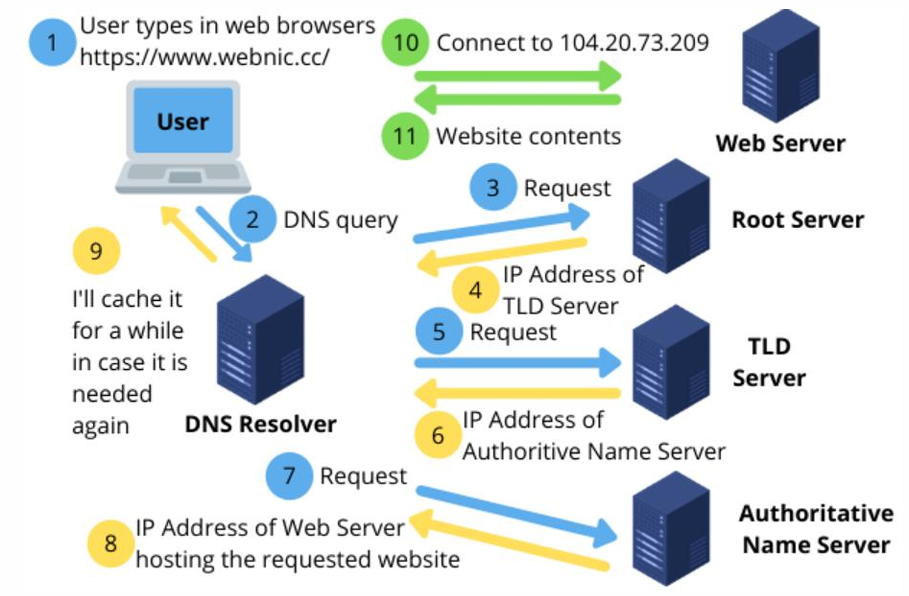
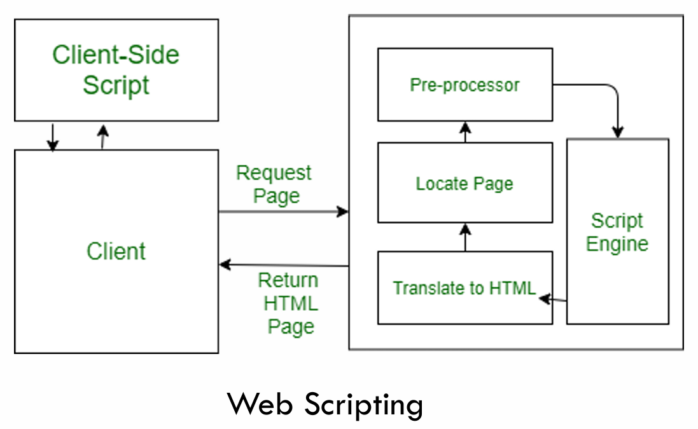

# Chapter 1: Introduction to WWW and The Internet

## Index
* [Chapter 1: Introduction to WWW and The Internet](#chapter-1-introduction-to-www-and-the-internet)
  * [Index](#index)
  * [1.1 Internet technology and the World Wide Web (WWW)](#11-internet-technology-and-the-world-wide-web-www)
  * [1.2 Web Application Architecture](#12-web-application-architecture)
    * [Internet Architecture](#internet-architecture)
  * [1.3 Server concept and Web client](#13-server-concept-and-web-client)
    * [Web Server](#web-server)
    * [Communication Network](#communication-network)
    * [Communication Protocols](#communication-protocols)
    * [TCP/IP:](#tcpip)
    * [HTTP](#http)
    * [FTP](#ftp)
    * [Internet Protocol (IP) Address](#internet-protocol-ip-address)
    * [Domain Name System (DNS)](#domain-name-system-dns)
    * [Uniform Resource Locator (URL)](#uniform-resource-locator-url)
    * [Web Page](#web-page)
      * [Static Website](#static-website)
      * [Dynamic Website](#dynamic-website)
  * [1.4 Web Browser](#14-web-browser)
    * [Main features of a web browser:](#main-features-of-a-web-browser)
  * [1.5 Evolution of the Internet and Web](#15-evolution-of-the-internet-and-web)
    * [History](#history)
  * [1.6 Analysis requirements and Web design](#16-analysis-requirements-and-web-design)
  * [1.7 Scripting, outline work and Web platform](#17-scripting-outline-work-and-web-platform)
    * [Types of Script](#types-of-script)


## 1.1 Internet technology and the World Wide Web (WWW)
1. The World Wide Web (WWW), or Web for short, are the pages shown at a device when online.
2. The Internet is the network of connected computers that the web works on.

[Back to Top](#chapter-1-introduction-to-www-and-the-internet)

## 1.2 Web Application Architecture
1. Client-Server architecture.
2. The client makes a service request and the server responds with the service.

### Internet Architecture
1. TCP/IP (Transmission Control Protocol/Internet Protocol) 
2. IP Address
3. Domain Name System (DNS)
4. Internet Service
5. WWW
6. URL
7. HTTP

[Back to Top](#chapter-1-introduction-to-www-and-the-internet)

## 1.3 Server concept and Web client
### Web Server
1. Software and hardware that uses Hypertext Transfer Protocol (HTTP) and other protocols to respond to client requests made over the Web.
2. Store, process and deliver web pages to clients.
3. Apache, Nginx, Microsoft IIS, iPlanet Web Server, etc.

### Communication Network
1. Internet is a global network of physical cables, which are include copper telephone wires and fiber optic cables.
2. Even wireless connections like Wi-Fi and 3G/4G/5G rely on these physical cables to access the Internet.

### Communication Protocols
1. A **standard** mechanism to allow **dissimilar systems** to communicate.
2. A single communication may involve different protocols.
3. Some common protocols:
   1. Transmission Control Protocol / Internet Protocol (TCP/IP)
   2. Hypertext Transfer Protocol (HTTP)
   3. File Transfer Protocol (FTP)

### TCP/IP:
- Enable a device to exchange data over network.
- TCP: control the assembly of message into packets before it is transmitted over the Internet, and reassembly of the packets once they reach their destination.
- IP: handle all the addressing details for each packet, ensuring that each is labeled with the correct destination address, which is the IP address.

### HTTP
- Allow Web resources to transfer between a web server and a web client.
- Defines what actions a web server and a web client should take in response to various commands.

### FTP
- Set of rules by which computers transfer data over the Internet.
- URL begins with ftp:// instead of http://
- Accessed either with a web browser or software that supports FTP.
- FTP site can be browsed as though they were files on the local computer - upload, download, manage files.
- FTP site may require login.

### Internet Protocol (IP) Address
- Unique identifier assigned to a device in a computer network.
- Public IP address: an IP address that can be accessed directly over the internet and is assigned to the router by an Internet Service Provider (ISP).
- Private IP address: an IP address in a local network.
- Two versions of IP addresses: IPv4 and IPv6.

### Domain Name System (DNS)
- A naming database in which Internet domain names are located and translated into Internet Protocol (IP) addresses.
- The whole system involves a collection of servers.


### Uniform Resource Locator (URL)
- Address of a given unique resource on the Web,
- Consist of three parts:
  1. Scheme (protocol)
  2. Authority (domain name)
  3. Port,
  4. Path to file,
  5. Parameters,
  6. Anchor

### Web Page
1. A document written in HTML (HyperText Markup Language) and can be viewed on any web browsers.
2. Stored in a specific directory within a web server.
3. May contain text, graphics, videos, hyperlinks to other pages etc.
4. A collection of related web pages that may contain text, images, audio and video.
5. The first page of a website is called home page.
6. Two types:
   1. staic website: the codes are fixed while its content rarely changes.
   2. dynamic website: its content changes dynamically.

#### Static Website 
- prebuilt content is the same every time the page is loaded.
- only uses the HTML codes.
- the same response for every request.
- the content is only changed when the source file is updated and published.

#### Dynamic Website
- content is generated quickly and changes regularly.
- employs the server-side languages such as PHP, ASP.NET, JSP, etc.
- generates different HTML each of the request.
- contains server-side codes allowing the server to generate unique content when the page is loaded.

[Back to Top](#chapter-1-introduction-to-www-and-the-internet)

## 1.4 Web Browser
- A software program that interpret and displays web pages thus allowing users to interact with web pages.
  - Interpret web pages delivered using HTTP into human-readable content.
  - Display web pages composed using Hypertext Markup Language (HTML) and/or Extensible Markup Language (XML).
- eg. Google Chrome, Mozilla Firefox, Microsoft Edge, Safari, Opera, etc.

### Main features of a web browser:
1. Personalization
2. Search engine
3. Bookmarks
4. Security settings

[Back to Top](#chapter-1-introduction-to-www-and-the-internet)

## 1.5 Evolution of the Internet and Web
### History
1. ARPANET (1969).
2. The Domain Name System (DNS) was developed in 1980s.
3. The first graphical web browser, called WorldWideWeb, was created by Tim Berners-Lee at CERN.
4. Tim Berners-Lee proposed the Web in 1989.
5. The first website was created in 1990.
6. The first content-based search protocol, Gopher, was created in 1991.
7. The first web browser, Mosaic, was created in 1993.
8. The first webmail service, Hotmail, was created in 1996.
9. Google was launched in 1998.

[Back to Top](#chapter-1-introduction-to-www-and-the-internet)

## 1.6 Analysis requirements and Web design
Topics generally covered during a standard web development requriements analysis:
1. Preferred platform and technology for development.
2. Standard layout of the website.
3. Design features such as logo, special fonts, ad space details
4. Features and functionality required,
5. Space allocation for content and photos
6. Header and footer details
7. Contact form and subscription details

[Back to Top](#chapter-1-introduction-to-www-and-the-internet)

## 1.7 Scripting, outline work and Web platform
- The process of creating and embedding scripts in a web page is known as web-scripting. A script or a computer-script is a list of commands that are embedded in a web page normally and are interpreted and executed by a certain program or scripting engine.

- Scripts may be written for a variety of purposes such as for automating processes on a local-computer or to generate web pages.

- The programming languages in which scripts are written are known as scripting languages. there are many scripting languages available today. Common scripting languages include:
  1. VBScript
  2. JavaScript
  3. ASP
  4. PHP
  5. Perl
  6. JSP

### Types of Script
Scripts are broadly of following two type:
1. Client-side scripts: executed on the client's browser.
2. Server-side scripts: executed on the server.

```html
<script type="text/javascript">
  document.write("Hello World!");
</script>
```

```php
<?php
  echo "Hello World!";
?>
```



[Back to Top](#chapter-1-introduction-to-www-and-the-internet)

[Next Chapter](C2.md)
[Back to README](README.md)