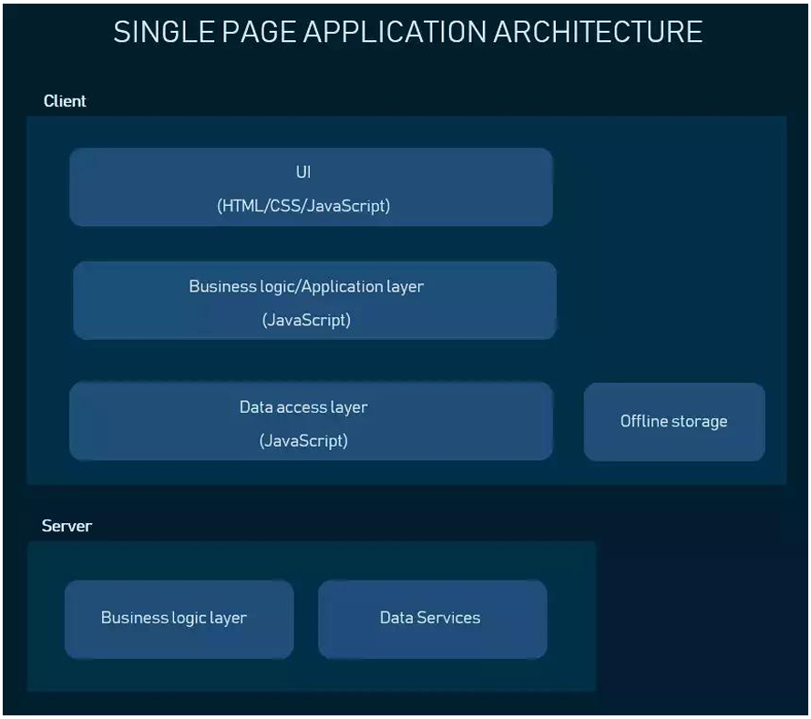
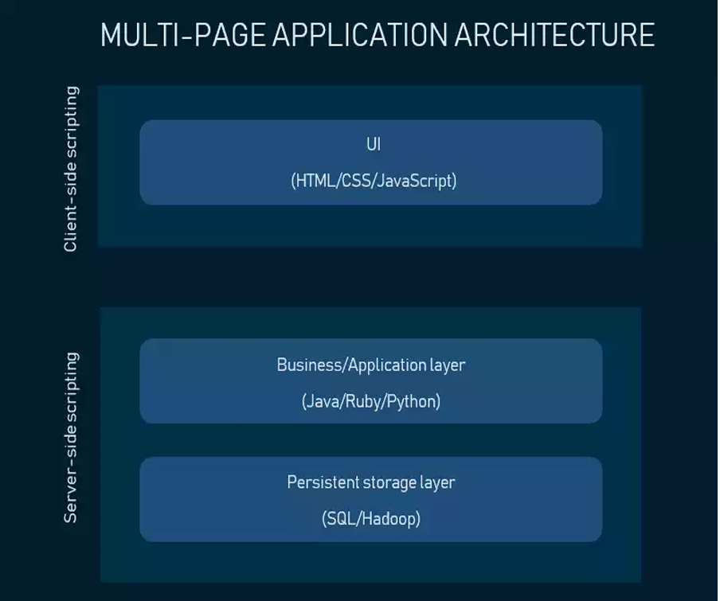

# Chapter 2 Markup Language

## Index
* [Chapter 2 Markup Language](#chapter-2-markup-language)
  * [Index](#index)
  * [2.1 Concept of structure and internal content Presentation Layer](#21-concept-of-structure-and-internal-content-presentation-layer)
    * [Presentation Layer](#presentation-layer)
    * [Single Page Application (SPA)](#single-page-application-spa)
    * [Multi-Page Application (MPA)](#multi-page-application-mpa)
  * [2.2 Introduction tp HyperText Markup Language (HTML)](#22-introduction-tp-hypertext-markup-language-html)
    * [History of HTML](#history-of-html)
    * [HTML Versions](#html-versions)
    * [HTML vs XHTML](#html-vs-xhtml)
    * [XHTML Elements](#xhtml-elements)
    * [XHTML Attributes](#xhtml-attributes)
  * [2.3 Tags and Elements](#23-tags-and-elements)
    * [HTML Tags](#html-tags)
    * [HTML Root Element](#html-root-element)
    * [HTML head and body elements](#html-head-and-body-elements)
    * [HTML tags and text](#html-tags-and-text)
      * [`<!DOCTYPE>`](#doctype)
      * [`<html>` and `</html>` tags](#html-and-html-tags)
      * [`<head>` and `</head>` tags](#head-and-head-tags)
      * [`<body>` and `</body>` tags](#body-and-body-tags)
  * [2.4 Basic Structure](#24-basic-structure)
    * [Headings / Title](#headings--title)
    * [Paragraphs](#paragraphs)
  * [2.5 Lists, Anchor, Images, Tables, Forms and etc.](#25-lists-anchor-images-tables-forms-and-etc)
    * [Lists](#lists)
    * [Anchor](#anchor)
    * [Images](#images)
    * [Forms](#forms)
    * [Form Components](#form-components)
    * [Audio](#audio)

## 2.1 Concept of structure and internal content Presentation Layer

### Presentation Layer
1. The presentation layer is accessible to users via a browser and consists of user interface components and UI process components that support interaction with the system.
2. Developed using thre core technologies:
   1. HTML
      - HTML is the code that determines what your website will contain.
   2. CSS
      - CSS controls how it will look. 
   3. JavaScript
      - JavaScript and its frameworks make your website interactive and responsive to a user's actions.
3. Developers use JS frameworks such as Angular and React to make the content on the page dynamic.

### Single Page Application (SPA)


### Multi-Page Application (MPA)


[Back to Top](#chapter-2-markup-language)

## 2.2 Introduction tp HyperText Markup Language (HTML)

- Markup language (ML) is the language that annotates text so that the computer can manipulate (format and align) the text.

- Most ML are human readable because they are written in a way distinguish them from the text.

- Example: XML, HTML, XHTML, LaTeX, etc.

- ML such as HTML (HyperText Markup Language) are used to build web pages and dictates how a browser will load, format and align text and graphics on a web page.

### History of HTML
- World Wide Web Consortium (W3C) is regarded as the de facto organization to govern HTML.
  
- WHATWG (Web Hypertext Application Technology Working Group) was formed in response to the slow development of web standards monitored by the W3C.

- W3C and WHATWG are in charge of the development of HTML5.2 which is the latest version of HTML (2018).

### HTML Versions

- HTML 4.01 (Dec 1999) syntax defined using SGML (Standard Generalized Markup Language).

- XHTML 1.0 (Jan 2000) syntax defined using XML (Extensible Markup Language).

- Primary differences:
  - HTML allows some tag omissions (e.g. end tags).
  - XHTML element and attribute names are lower case (HTML names are case-insensitive).
  - XHTML requires that attribute values be quoted

### HTML vs XHTML
- XHTML is HTML written as XML.
- What is XHTML ?
  - XHTML stands for
  - Extensible HyperText Markup Language.
  - XHTML is almost identical to HTML
  - XHTML is stricter than HTML
  - XHTML is HTML defined as an XML application
  - XHTML is supported by all major browsers
- Document Structure
  - XHTML DOCTYPE is **mandatory**
  - The xmls attribute in `<html>` is **mandatory**
  - `<html>, <head>, <title>,` and `<body>` are **mandatory**

### XHTML Elements
- XHTML elements must be **properly nested**
- XHTML elements must always be **closed**
- XHTML elements must be in **lowercase**
- XHTML documents must have **one root element**

### XHTML Attributes
- Attribute names must be in **lower case**
- Attribute values must be **quoted**
- Attribute minimization is **forbidden**

[Back to Top](#chapter-2-markup-language)

## 2.3 Tags and Elements

### HTML Tags
- Any string of the form `<...>` is a tag.
- All tags in document either end tags (beginning with `</`) or start tags (beginning with `<`).
  - Tags are an example of markup, that is, text treated specially by the browser.
  - Non-markup text is called character data and is normally displayed by the browser.

- String at the beginning of start/end tag is an element name.
- Everything from start tag to matching end tag, including tags, is an element.
  - Content of an element excludes its start and end tags.

### HTML Root Element
- Document type declaration specifies name of root element:
  `<!DOCTYPE html>`
- Root of HTML document must be html
- XHTML 1.0 (standard we will follow) requires that this element contain the xml namespace xmlns attribute specification (name/value pair).

```xhtml
<html xmlns="http://www.w3.org/1999/xhtml">
```

### HTML head and body elements
- The **body** element contains information displayed in the browser client area.
- The **head** element contains information used for other purposes by the browser:
  - title (shown in title bar of browser window)
  - scripts (client-side programs)
  - style (display) information
  - etc.

### HTML tags and text
- Web pages structures are defined by `<!DOCTYPE>` tag and 4 **sets** of tags (`<html>`, `<head>`, `<title>`, `<body>`) which divide the HTML file into basic sections such as the header information and body of the page that contains text and graphics.

#### `<!DOCTYPE>`
- describes the browser which HTML or XHTML version and type the document uses.

#### `<html>` and `</html>` tags
- indicate the start and end of the HTML document.

#### `<head>` and `</head>` tags
- contain the `<title>` of the document which indicates the title of the web page displayed in browser title bar. 

#### `<body>` and `</body>` tags
- holds web page content such as text, images, links, tables, lists, etc.

[Back to Top](#chapter-2-markup-language)

## 2.4 Basic Structure
### Headings / Title
- Headings serves to separate text and introduce new topics on web pages.
- The heading used for this purpose **vary in sizes** range from `<h1>` to `<h6>` with `<h1>` being the largest and `<h6>` the smallest.

### Paragraphs
- Web pages generally contain a significant amount of text.
- Breaking the text into paragraph helps to separate key ideas and make the text easier to read.

[Back to Top](#chapter-2-markup-language)

## 2.5 Lists, Anchor, Images, Tables, Forms and etc.
### Lists
1. Ordered List
   - Starts with `<ol>` tag and ends with `</ol>` tag.
   - `<li>` tag is used to create list items.
   - For example:
     ```html
     <ol>
         <li>Item 1</li>
         <li>Item 2</li>
         <li>Item 3</li>
     </ol>
     ```
2. Unordered List
   - Starts with `<ul>` tag and ends with `</ul>` tag.
   - `<li>` tag is used to create list items.
   - For example:
     ```html
     <ul>
         <li>Item 1</li>
         <li>Item 2</li>
         <li>Item 3</li>
     </ul>
     ```

### Anchor
- Hyperlink defines by `<a>` tag.
- The `href` attribute specifies the destination of a link (url).
- Links text to another document.
- For example:
  ```html
  <a href="https://www.google.com">Google</a>
  ```

### Images
- Images are displayed using the `` tag.
- The `src` attribute specifies the source of image for display(url).
- For example:
- ```html
  
  ```

### Tables
- `<table>` and `</table>` tags are used to indicates table.
- Table consist of **rows, columns, and cell**, much like spreadsheet.
- Divided into **rows** using `<tr>` and `</tr>` tags.
- Each row is divided into **column** using `<td>` and `</td>` tags.
- `<td>` and `</td>` tags are used to specify the content of each cell.
- `<tr>` and `</tr>` tags indicates table row.

- Example:
  ```html
  <table>
      <tr>
          <td>Product</td>
          <td>Quantity</td>
      </tr>
      <tr>
          <td>Printer</td>
          <td>5</td>
      </tr>
  </table>
  ```

- Output:
  | Product | Quantity |
  |---------|----------|
  | Printer | 5        |

### Forms
- used to gather information from web site visitors for a number of purposes.
- Fow of commonly used forms include:
  - Feedback form : to gather visitor's comments on the web site.
  - Guestbook: to allow user to sign in as visitors to the site
  - Registration form: for vistor to create an account, including username and password.
  - Survey form: to gather information on any number of topics.
  - Search form: for users to initiate a search for a word, a phrase, or other information.
  - Order form: to select product and enter shipping and payment information.

### Form Components
- `<form>` tag, which contains the information necessary to process the form.
- **Input controls**, which provide input mechanism on form
- **Submit button**, which sends data to be processed.
- Example:
- ```html
  <form action="action.asp" method="post">
      <label for="name">Name:</label>
      <input type="text" id="name" name="name">
      <input type="submit" value="Submit">
  </form>
  ```

### Input Controls
- Input controls can be classified as:
  - Data input control
    - Can either be a radio button, checkbox, or selection menu.
    - Radio button
      - ```html
        <input type="radio" name="sex" value="male">Male<br>
        <input type="radio" name="sex" value="female">Female
        ```
      - Output:
      - <input type="radio" name="sex" value="male">Male
      - <input type="radio" name="sex" value="female">Female
    - Checkbox
      - <input type="checkbox" name="vehicle" value="Bike">I have a bike
      - <input type="checkbox" name="vehicle" value="Car">I have a car
    - Menu/List
      - <select name="cars">
          <option value="volvo">Volvo</option>
          <option value="saab">Saab</option>
          <option value="mercedes">Mercedes</option>
          <option value="audi">Audi</option>
        </select>
  - Text input control
    - either a text box or a text area or a password box.
    - Text box
      - First Name: <input type="text" name="firstname">
      - Last Name: <input type="text" name="lastname">

### Video
- most beneficial and popular HTML5 feature is `<video>` tag.
- Supports multiple video formats.
  - MP4, WebM, and Ogg.
- For example:
- ```html
  <video width="320" height="240" controls>
      <source src="movie.mp4" type="video/mp4">
      <source src="movie.ogg" type="video/ogg">
      Your browser does not support the video tag.
  </video>
  ```

### Audio
- Defines sound, such as music or other audio streams by `<audio>` tag.
- Supports multiple audio formats.
  - MP3, WAV, and Flac.
- For example:
- ```html
  <audio controls>
      <source src="horse.ogg" type="audio/ogg">
      <source src="horse.mp3" type="audio/mpeg">
      Your browser does not support the audio element.
  </audio>
  ```

### Other form controls
- Other form controls include:
  - Fieldset
  - Password
  - Clickable image
  - Non-submit buttons
  - Hidden (embed data)
  - File upload
  - Hierarchical menus

### HTML References
- Non-breaking space: `&nbsp;`
- Line break: `<br>`
- Horizontal rule: `<hr>`
- Comment: `<!-- comment -->`
- Special characters: `&lt;`, `&gt;`, `&amp;`, `&quot;`, `&copy;`, `&reg;`

[Back to Top](#chapter-2-markup-language)

## 2.6 Page-Structure Elements

```html
<!DOCTYPE html> 
<!-- Placed at top of every HTML5 page (indicates HTML version) -->
<html>
    <head>
        <!-- special instruction for Search Engine Optimization (SEO) -->
    </head>
    <body>
        <!-- Tags for content display -->
    </body>
</html>
```

[Back to Top](#chapter-2-markup-language)

[Next Chapter](C3.md)
[Back to README](README.md)