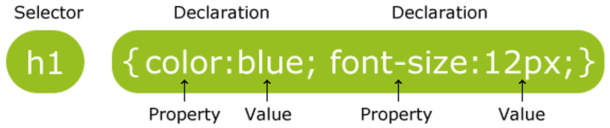
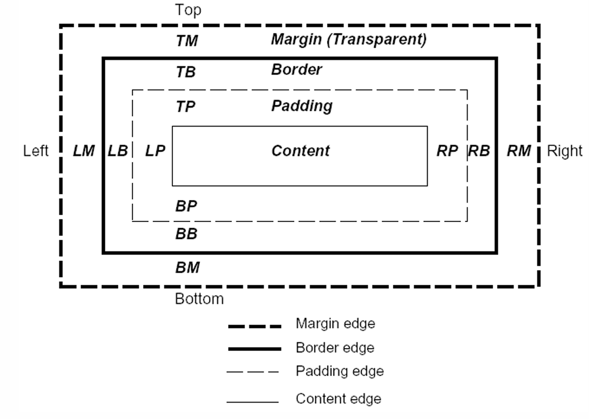

# Chapter 3 Style Sheet

## Index
* [Chapter 3 Style Sheet](#chapter-3-style-sheet)
  * [Index](#index)
  * [3.1 Cascading Style Sheets (CSS)](#31-cascading-style-sheets-css)
    * [Style Sheet](#style-sheet)
  * [3.2 Types of CSS](#32-types-of-css)
  * [3.3 Rules and Syntax CSS](#33-rules-and-syntax-css)
    * [Format](#format)
      * [Table of CSS Properties](#table-of-css-properties)
  * [3.4 CSS Basics: Selectors](#34-css-basics-selectors)
    * [Types of Selectors](#types-of-selectors)
    * [Selector Strings](#selector-strings)
  * [3.5 Declaration, Properties](#35-declaration-properties)
    * [Box Properties](#box-properties)
      * [Box Model](#box-model)
    * [Text Properties](#text-properties)
    * [List Properties](#list-properties)
    * [Background Properties](#background-properties)
  * [3.6 Property Value](#36-property-value)
    * [Length](#length)
    * [Percentages](#percentages)
    * [URLs \& URIs](#urls--uris)
    * [Colors](#colors)
    * [Strings](#strings)


## 3.1 Cascading Style Sheets (CSS)
- Cascading Style Sheets (CSS) is a simple mechanism for adding style (e.g. fonts, colors, layouts) to Web documents.
- Styles provide powerful control over the presentation of web pages.

### Style Sheet
1. A style sheet consists of a set of rules.
2. Each rule consists of one or more selectors and a declaration block.
3. A declaration block consists of a list of declarations curly braces `{}`.
4. Each declaration consists of a property, a property value, and a colon `:`, a value, then a semicolon `;`.

```css
selector {
  property: value;
  property: value;
}
```

[Back to Top](#chapter-3-style-sheet)

## 3.2 Types of CSS
1. Embedded CSS: is used to control the style for a single web page.
2. Inline CSS: is used to define style for only a single HTML tag.
3. External (Linked) CSS: is used to control the appearance of multiple pages in a website.

```html
<!DOCTYPE html>
<html>
<head>
    <!-- Embedded CSS -->
    <style>
        h1 {
            color: blue;
            text-align: center;
        }
    </style>
    <!-- External (linked) CSS -->
    <link rel="stylesheet" type="text/css" href="style.css"> 
</head>
<body>
    <!-- Inline CSS -->
    <h1 style="color: red; text-align: center;">This is a heading</h1>
    <p>This is a paragraph.</p>
</body>
</html>
```

[Back to Top](#chapter-3-style-sheet)

## 3.3 Rules and Syntax CSS
### Format 
1. A style statement is made up of a selector and a declaration.
2. A **selector** identifies the page elements.
3. A **declaration** identifies how the elements should display.
4. A **declaration** defines style for one or more properties, for selected elements.
5. For each **property**, the declaration includes a related value, which specifies the display parameters for that specific property.



#### Table of CSS Properties
| Property Name | Options that can be controlled |
| --- | --- |
| background | Color, image, position |
| border | Color, width, style |
| font | Family, size, style, variant, weight |
| list | Image, position, type |
| margin | Length, percentage |
| Text | Alignment, decoration, indentation, white spacing, wrap |

[Back to Top](#chapter-3-style-sheet)

## 3.4 CSS Basics: Selectors
### Types of Selectors
1. Tag
   - redefines the look of a specific tag
   - ```css
     h1 {
       color: blue;
     }
     ```
2. Class
   - a category defined for specific elements of HTML files
   - One defined, a specific style can be created for each class.
   - can apply to any tag
   - ```css
     .class-name {
       color: blue;
     }
     ```
3. Advanced
   - IDs, pseudo-class selectors.
   - ```css
     #id-name {
       color: blue;
     }
     ``` 

### Selector Strings
1. Single element type:
   - ```css
        * { font-weight: bold; }
     ```
2. Multiple element types:
   - ```css
        p { font-size: smaller; letter-spacing: 1em; }
     ```
3. All element types:
   - ```css
        h1, h2, h3, h4, h5, h6 { background-color: purple; }
     ```
4. Specific elements by id:
   - ```css
        #p1, #p3 { background-color: aqua; }
     ```

[Back to Top](#chapter-3-style-sheet)

## 3.5 Declaration, Properties

### Box Properties
- margin: `<length>`
- border: `<style>` `<width>` `<color>`
- padding: `<length>`
- width & height: `<length>`
- Example:
  ```css
  div {
    margin: 10px;
    border: 1px solid black;
    padding: 10px;
    width: 300px;
    height: 100px;
  }
  ```

#### Box Model



### Text Properties
- font-family: `<font name>`, `<font name>`, `<font name>`
- font-size: `<length>` `<percentage>` `inherit`
- font-weight: normal, bold, bolder, lighter
- font-style: normal, italic, oblique, inherit
- line-height: normal, `<length>` `<percentage>` `inherit`
- text-transform: capitalize, uppercase, lowercase, none, inherit
- color: `<color>` `rgb()` `rgba()`
- text-indent: `<length>` `<percentage>` `inherit`
- text-align: left, right, center, justify, inherit

### List Properties
- list-style: disc, circle, square, decimal, lower-alpha, upper-alpha, lower-roman, upper-roman

### Background Properties
- background-color: `<color>` `transparent` `inherit`
- background-image: `<url>` `none` `inherit`
- background-position: [[ `<percentage>` | `<length>` | left | center | right ] [ `<percentage>` | `<length>` | top | center | bottom ]] | inherit
- background-repeat: repeat, repeat-x, repeat-y, no-repeat, inherit
- background-attachment: scroll, fixed, inherit

[Back to Top](#chapter-3-style-sheet)

## 3.6 Property Value
### Length
- Unit identifier can be
   - em (font size of the relevant font),
   - ex (x-height of the relevant font),
   - px (pixels),
   - in (inches), cm (centimeters), mm,
   - pt (points), pc (picas),

### Percentages
- [0, 100]%

### URLs & URIs
- url(""), or
- url()

### Colors
- keyword: red, blue, green, etc.
- a numerical RGB specification: rgb(255, 0, 0) 

### Strings
- "string" or 'string'

[Back to Top](#chapter-3-style-sheet)

[Next Chapter](C4.md)
[Back to README](README.md)