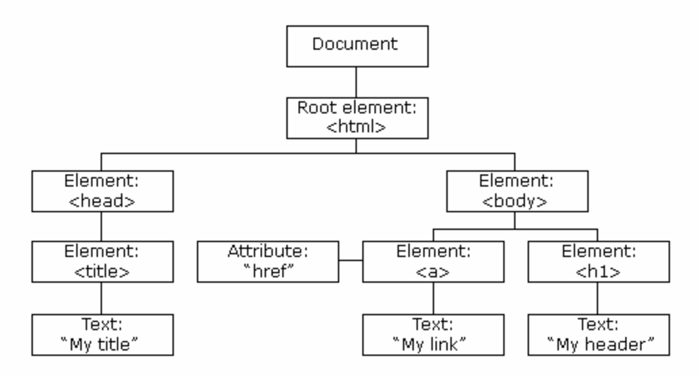

# Chpater 4 Client-Side Scripting

## Index
* [Chpater 4 Client-Side Scripting](#chpater-4-client-side-scripting)
  * [Index](#index)
  * [4.1 Client-Side Scripting](#41-client-side-scripting)
  * [4.2 Introduction to JavaScript](#42-introduction-to-javascript)
    * [JavaScript](#javascript)
    * [Evolution of JavaScript](#evolution-of-javascript)
    * [Capabilities of JavaScript](#capabilities-of-javascript)
    * [Execution Environment](#execution-environment)
    * [Importance of JavaScript](#importance-of-javascript)
  * [4.3 JavaScript Basics](#43-javascript-basics)
    * [JS Implementation](#js-implementation)
    * [JS Syntax](#js-syntax)
    * [Variables](#variables)
    * [Operators](#operators)
    * [Input / Output](#input--output)
    * [Control Structures](#control-structures)
    * [Functions](#functions)
    * [Arrays](#arrays)
    * [Objects](#objects)
  * [4.4 DOM Manipulation](#44-dom-manipulation)
    * [Document Object Model (DOM)](#document-object-model-dom)
      * [DOM Tree](#dom-tree)
    * [DOM Selection Methods](#dom-selection-methods)
    * [DOM Style Manipulation](#dom-style-manipulation)
    * [DOM form manipulation](#dom-form-manipulation)
  * [4.5 Event Handling](#45-event-handling)
    * [Event Listener](#event-listener)
  * [4.6 JSON (JavaScript Object Notation)](#46-json-javascript-object-notation)
    * [Parsing JSON](#parsing-json)
    * [JSON in API Integration](#json-in-api-integration)
  * [4.7 Introduction to jQuery](#47-introduction-to-jquery)
    * [DOM Manipulation with Vanilla JS](#dom-manipulation-with-vanilla-js)
      * [Notes](#notes)
    * [jQuery Basics](#jquery-basics)
    * [Getting Started](#getting-started)
    * [jQuery Syntax](#jquery-syntax)
    * [Selectors](#selectors)
    * [Modifying Content](#modifying-content)
    * [Modifying CSS](#modifying-css)
    * [Traversing](#traversing)
    * [Events](#events)
    * [Effects](#effects)
    * [References](#references)

## 4.1 Client-Side Scripting
1. Client-side scripting refers to scripts that are **executed on the user's browser** instead of the server. Unlike server-side scripting, which uses languages like PHP and Python to process on the server, client-side scripting processes on the user's browser.
2. Its primary purpose is to **enhance the user experience** by making web pages **interactive** and **dynamically responsive** to user inputs.
3. The most commonly used languages include JavaScript, HTML5, and CSS.
4. JS is the predominant language used for client-side scripting.
5. HTML5 and CSS are used to structure and style the web page, while JavaScript enables interactivity.
6. Libraries like jQuery and frameworks like React and Angular are also integral to modern client-side scripting.

| Aspect | Advantages | Disadvantages |
| --- | --- | --- |
| **Speed and Efficiency** | Scripts executed on the client-side lead to **faster** user interactions since there is no need to communicate with the server for every action. | Heavily scripted pages can degrade performance on **less capable devices or browsers**. |
| **Server Load** | Processing data on the client-side significantly **reduces the load on the server**. | Browser Dependency: Functionality can **vary** depending on the **user's browser compatibility**. |
| **User Experience** | Enables the creation of **rich**, **engaging**, and **responsive** user interfaces. | **Security Concerns**: Since the code is executed on the client's machine and is **more exposed**, it poses inherent security risks. | 

[Back to Top](#chpater-4-client-side-scripting)

## 4.2 Introduction to JavaScript
### JavaScript
1. a **high-level**, **interpreted** programming language.
2. Essential to web development alongside HTML and CSS.
3. Enables **interactive web pages** and is an essential part of web applications.

### Evolution of JavaScript
- Created in 1995 by **Brendan Eich** while working at **Netscape**.
- Initially named **Mocha**, then **LiveScript**, and finally **JavaScript**.
- Standardized by **ECMA International** in 1997 as **ECMAScript**.

### Capabilities of JavaScript
- **Dynamic Content**: Update and modify web content in real time without reloading the page using AJAX and DOM manipulation.
- **Interactive Elements**: Enhance user experiences with interactive forms, sliders, and content that reacts to user inputs.
- **Animations and Graphics**: Create complex animations and render 2D/3D graphics using libraries like **Three.js** and **WebGL**.
- **Server-Side Operations**: With Node.js, handle backend tasks such as file operations, database interactions, and server logic.
- **Real-Time Applications**: Develop real-time applications like chat applications, live content streaming using **WebSockets**.

### Execution Environment
- **Browser**: Executes JavaScript code directly within the web browser to make webpages interactive.
- **Server**: Utilizes Node.js to execute JavaScript outside the browser, enabling full-stack development with a single language.

### Importance of JavaScript
- Runs on nearly all browsers without the need for plugins.
- Increases the interactivity, speed, and usability of websites.
- Employed by all modern web applications.
- Frontend Development: Runs in the browser, handling user interactions, UI updates, and client-side logic.
- Backend Development: With Node.js, JavaScript runs on the server, handling database operations, server-side logic, and API services.

[Back to Top](#chpater-4-client-side-scripting)

## 4.3 JavaScript Basics
### JS Implementation
1. **Inline**: used within HTML for events.
2. **Embedded**: within the `<script>` tag in the HTML tags.
3. **External**: JavaScript code is written in a separate file with the `.js` extension.
4. **Console**: Press `F12` key in most web browsers.

```html
<!DOCTYPE html>
<html>
<head>
    <title>JavaScript Basics</title>
    <script>
        // Embedded JavaScript
        alert("Hello, World!");
    </script>
    <!-- External JavaScript -->
    <script src="app.js"></script>
</head>
<body>
    <h1>JavaScript Basics</h1>
    <p>JavaScript is a high-level, interpreted programming language.</p>
    <button onclick="alert('Inline JS')">Click Me</button>
</body>
</html>
```

### JS Syntax
- JavaScript is **case-sensitive**.
- `Student` and `student` are treated as different variables.
- ```js
    let Student = "John";
    let student = "Doe";
  ```
- Comments are ignored by the JavaScript engine and therefore do not affect the output of the code.
- Single-line comments are denoted by `//`, while multi-line comments are enclosed within `/*` and `*/`.
- Multi-line comments are useful for providing detailed explanations or temporarily disabling code.

```js
// Single-line comment
/* Multi-line comment
alert("Hello, World!"); //
   Used for detailed explanations */
```

- JavaScript's ASI (Automatic Semicolon Insertion) mechanism helps prevent potential errors by **automatically inserting semicolons at the end of lines where they are omitted**.
- However, relying on ASI can **sometimes lead to unexpected results**, so it's **good practice to explicitly include semicolons where necessary**.
- This ensures that the code executes as intended and improves readability for others reviewing the code.

### Variables
- Variables serve as containers for storing data values.
- **Declaring a variable can be done using different keywords** depending on the needed scope and reassignment behavior.
  - `let`: Declares a block-scoped variable that can be reassigned.
  - `const`: Declares a block-scoped variable that cannot be reassigned.
  - `var`: Declares a variable with function scope or global scope that can be reassigned.
- JS is **dynamically typed**, which means **you don't explicitly declare data types of variables when you declare them**. 
- Variable is determined at runtime based on the value it holds at that time.
- Since data from web forms or other sources often arrives as **text**, it is essential to **convert this text to a numeric data type before performing calculations** or other number-based manipulations.
- This is where **type casting** comes into play.
  - `parseInt()`: Converts a string to an integer.
  - `parseFloat()`: Converts a string to a floating-point number.
  - `toString()`: Converts a number to a string.
  - `toFixed()`: Formats a number using fixed-point notation.

### Operators
1. **Arithmetic Operators**: Used to perform arithmetic operations on numeric values.
   - `+`: Addition
   - `-`: Subtraction
   - `*`: Multiplication
   - `/`: Division
   - `%`: Modulus (Remainder)
   - `++`: Increment
   - `--`: Decrement

### Input / Output
1. Interacting with Users:
   - `alert()`: Displays a message box with an OK button.
   - `prompt()`: Displays a message box with an input field.
   - `confirm()`: Displays a message box with OK and Cancel buttons.
2. Displaying Output:
   - `document.write()`: to write directly to the HTML document.
   - `console.log()`: Output information to the browser console.
3. DOM Manipulation:
   - `document.getElementById()`: Accesses an element by its ID.
   - `document.getElementsByClassName()`: Accesses elements by their class name.
   - `document.getElementsByTagName()`: Accesses elements by their tag name.

### Control Structures
1. Conditional statements are a fundamental concept in software development, allowing a program to execute different code segments based on whether certain conditions are met.
2. Conditional statements in JavaScript include:
   - `if` statement: Executes a block of code if a specified condition is true.
   - `else` statement: Specifies a block of code to be executed if the same condition is false.
   - `else if` statement: Specifies a new condition if the first condition is false.
   - `switch` statement: Evaluates an expression and executes code blocks based on matching cases.

3. Loops help in repeating code until a certain condition is met.
4. Types of loops:
   - `for`
   - `for-in`
   - `for-of`
   - `while`
   - `do...while`

### Functions
1. Functions are reusable blocks of code that perform a specific task.
2. Help organize and modularize code, making it easier to read, maintain, and debug.
3. Javascript provides many built-in functions, like `console.log()`, which is used for printing output to the console.
4. Additionally, custom functions can be defined to perform actions unique to the needs of the application.
5. These functions can take inputs known as parameters and can also return a value as an output.
6. Three common patterns for defining functions in JavaScript:
   - Function Declaration
     - ```js
       function functionName(parameters) {
           // code block
       }
       ```
   - Function Expression
     - ```js
       const functionName = function(parameters) {
           // code block
       };
       ``` 
   - Arrow Function
     - ```js
       const functionName = (parameters) => {
           // code block
       };
       ```

### Arrays
1. Arrays are versatile data structures that can hold multiple values at once, allowing for efficient storage and access to data.
2. The literal syntax for creating an array in JavaScript involves enclosing the elements within square brackets `[]`.
3. The object syntax for creating an array involves using the `new Array()` constructor.

### Objects
1. Objects in JS are collections of properties and methods.
2. Properties are values associated with the object, while methods are functions that can be called on the object.
3. **Literal syntax**: A more straightforward and common way to create objects. `{}` is used to define an object.
4. **Object constructor**: The `new Object()` constructor can also be used to create objects.

[Back to Top](#chpater-4-client-side-scripting)

## 4.4 DOM Manipulation
### Document Object Model (DOM)
1. The Document Object Model (DOM) is a programming interface for web documents. It represnets the page as a structured hierarchy of objects that scripts can modify.
2. With DOM manipulation, we can dynamically alter content within a web page, such as:
   - Changing CSS/style properties, for instance, `font size`.
   - Modifying attributes, such as `src` for `` tags.
   - Editing text content within elements.
   - Adding new elements to or removing existing elements from the page.
3. all HTML elements are treated as objects.
4. Key Aspects of DOM Manipulation:
   - **Targeting Elements**: Selecting specific elements to manipulate.
   - **Updating Style**: Altering CSS properties of elements to change their visual appearance.
   - **Updating Attributes**: Modifying the attributes of elements, such as `src`, `href`, or `class`.
   - **Modifying Content**: Changing the text or HTML content of elements. 
   - **Node Element Management**: Handling the addition, removal, or rearrangement of nodes in the DOM tree.

#### DOM Tree


### DOM Selection Methods
1. **getElementById()**: Selects an element based on its unique ID attribute.
2. **getElementsByClassName()**: Selects elements based on their class attribute.
3. **getElementsByTagName()**: Selects elements based on their tag name.
4. **querySelector()**: Selects the first element that matches a specified CSS selector.
5. **querySelectorAll()**: Selects all elements that match a specified CSS selector.
6. **getElementById()** is the most efficient method for selecting elements, as it directly accesses the element by its unique ID.
7. **document.forms** returns a collection of all form elements in the document.

### DOM Style Manipulation
1. **style.property**: Directly access and modify the CSS properties of an element.
2. **style.cssText**: Set multiple CSS properties at once.
```js
  const element = document.getElementById("myElement");
  element.style.color = "red";
  element.style.fontSize = "20px";
  element.style.backgroundColor = "lightblue";
```
3. **classList**: Provides methods to add, remove, toggle, and check for the presence of classes on an element.
4. **className**: Accesses or sets the class attribute of an element.

```js
  const element = document.getElementById("myElement");
  element.classList.add("newClass");
  element.classList.remove("oldClass");
  element.classList.toggle("active");
  element.classList.contains("newClass");
  element.className = "newClass";
```

### DOM form manipulation
1. **value**: Accesses or sets the value of form elements like input, select, and textarea.
2. **checked**: Determines if a checkbox or radio button is checked.
3. **selectedIndex**: Accesses or sets the selected index of a dropdown list.
4. **selectedOptions**: Accesses the selected options in a multiple-selection list.
5. **selected**: Determines if an option is selected in a dropdown list.
6. **disabled**: Disables or enables form elements.

[Back to Top](#chpater-4-client-side-scripting)

## 4.5 Event Handling
1. **Events** are actions or occurrences that happen in the system you are programming, which the system tells you about so your code can react to them.
2. **Event Handling** refers to the mechanism that controls the event and decides **what should happen if an event occurs**.
3. This mechanism allows JS to interact with HTML elements.

| Event Type | Description | Example |
| --- | --- | --- |
| **Mouse Events** | Triggered by mouse actions like clicks, hovers, and scrolls. | `click`, `mouseover`, `mouseout`, `scroll` |
| **Keyboard Events** | Triggered by keyboard actions like key presses and releases. | `keydown`, `keyup`, `keypress` |
| **Form Events** | Triggered by form element actions like submitting, resetting, and changing. | `submit`, `reset`, `change`, `focus`, `blur` |
| **Document Events** | Triggered by document actions like loading and unloading. | `load`, `unload` |
| **Window Events** | Triggered by window actions like resizing and scrolling. | `resize`, `scroll` |
| **Media Events** | Triggered by media actions like playing, pausing, and seeking. | `play`, `pause`, `seeked` |
| **Drag Events** | Triggered by drag-and-drop actions. | `dragstart`, `dragend`, `drop` |

### Event Listener
1. **Event listeners** are functions that listen for specific events and execute code when the event occurs.
2. **addEventListener()** method is used to attach an event handler to an element.
3. The method takes three parameters:
   - **Event**: The event type to listen for.
   - **Function**: The function to execute when the event occurs.
   - **UseCapture**: An optional boolean value that specifies whether the event should

[Back to Top](#chpater-4-client-side-scripting)

## 4.6 JSON (JavaScript Object Notation)
1. Lightweight data interchange format that is easy for humans to read and write and easy for machines to parse and generate.
2. It acts as data representation format very similar to XML.
3. Commonly used for APIs and configuration files.
4. Integrates seamlessly with JavaScript and with other languages too.
5. use KV (Key-Value) pairs to represent data.
6. Data types include strings `"Hello"`, numbers `123`, arrays `[1, 2, 3]`, objects `{ "key": "value" }`, booleans `true`, `false`, and `null`.

```json
{
  "name": "John Doe",
  "age": 30,
  "isStudent": true,
  "courses": ["Math", "Science"],
  "address": {
    "street": "123 Main St",
    "city": "New York"
  }
}
```

### Parsing JSON
1. **JSON.parse()**: Converts a JSON string into a JavaScript object.
2. Libraries like **jQuery** and **Lodash** provide additional utility functions for working with JSON data.
3. **JSON.stringify()**: Converts a JavaScript object into a JSON string.

```js
let data = {
  name: "John Doe",
  age: 30,
  isStudent: true,
  courses: ["Math", "Science"],
  address: {
    street: "123 Main St",
    city: "New York"
  }
};

let jsonString = JSON.stringify(data);
console.log(jsonString); 
// Output: {"name":"John Doe","age":30,"isStudent":true,"courses":["Math","Science"],"address":{"street":"123 Main St","city":"New York"}}
```
### JSON in API Integration
1. JSON commonly used in API integration.
2. Examples of popular APIs that use JSON include **Twitter**, **Facebook**, **Google Maps**, and **GitHub**.
3. JSON data can be easily transmitted over HTTP.

## 4.7 Introduction to jQuery
1. **jQuery** is a popular JavaScript library that simplifies DOM manipulation and enhances user experience.
2. Allows developer to write less code and achieve more functionality.

### DOM Manipulation with Vanilla JS
```js
const element = document.getElementById("myElement");
element.innerHTML = "Hello, World!";
```
#### Notes
1. Vanilla JS is the term used to describe the use of plain JavaScript without any additional libraries or frameworks.

### jQuery Basics
1. a simplified DOM manipulation library.
2. Uses CSS-style selectors to target HTML elements.
3. Example: Changing the text of an HTML element using jQuery.
```js
$("#myElement").text("Hello, World!");
```

### Getting Started
1. Several ways to start using jQuery:
    - **Download**: Download the jQuery library from the official website and include it in your project.
    - **CDN**: Include the jQuery library directly from a CDN (Content Delivery Network).
    - **NPM**: Install jQuery using npm (Node Package Manager).
  ```html
  <!-- Include jQuery from CDN -->
  <script src="https://code.jquery.com/jquery-3.6.0.min.js"></script>
  ```

### jQuery Syntax
1. Basic syntax is: `$(selector).action()`.
   - `$`: Access the jQuery library.
   - `selector`: Selects the HTML element(s) to manipulate.
   - `action()`: Perform an action on the selected element(s).
2. Example:
   - `$(this).hide()`: Hides the current element.
   - `$("p").hide()`: Hides all `<p>` elements.
   - `$(".test").hide()`: Hides all elements with class `test`.
   - `$("#test").hide()`: Hides the element with ID `test`.

### Selectors
1. jQuery provides a wide range of selectors to target HTML element, class and ID selectors.
2. Selectors can be combined to create complex queries.
3. In jQuery, we can use either single quotes `'` or double quotes `"` to wrap the selector.
4. Exameples:
   - Select all `<p>` elements: `$("p")`.
   - Select all elements with the `intro` class: `$(".intro")`.
   - Select all paragraphs with a class of `intro`: `$("p.intro")`.
   - Select the element with ID `unique`: `$("#unique")`.

### Modifying Content
1. `html()`: Get or set the HTML contents of the selected elements.
   - `$("p").html()`: Get the HTML content of all `<p>` elements.
   - `$("p").html("Hello, World!")`: Set the HTML content of all `<p>` elements.
2. `text()`: Get or set the text content of the selected elements.
   - `$("p").text()`: Get the text content of all `<p>` elements.
   - `$("p").text("Hello, World!")`: Set the text content of all `<p>` elements.
3. `append()`: Insert content at the end of the selected elements.
   - `$("p").append("Hello, World!")`: Append content to all `<p>` elements.
4. `prepend()`: Insert content at the beginning of the selected elements. 
   - `$("p").prepend("Hello, World!")`: Prepend content to all `<p>` elements.

### Modifying CSS
1. jQuery provides methods to dynamically change the CSS of HTML elements.
2. The `addClass()` method adds one or more class names to the selected elements.
3. This does not replace existing class attributes but instead appends the class to the class list.
4. Example:
   - Adds `active` class to all elements with class `item`:
   - `$(".item").addClass("active")`.
5. The `css()` method in jQuery is used to get or set style properties of selected elements.
6. provides a powerful way to interact with the styling of elements dynamically, facilitating responsive and interactive design.
7. Examples:
   - Sets the text colour to blue for the element with `ID` header:
   - `$("#header").css("color", "blue")`.
   - Sets font size and color for all `<p>` elements:
   - `$("p").css({ "font-size": "16px", "color": "red" })`.
   - Changing the style of an `h1` element when a button is clicked:
   - ```js
     $("#btn").click(function() {
         $("h1").css("background-color", "green");
     });
     ```

### Traversing 
1. Traversing in jQuery allows for easy navigation of the DOM tree.
2. It provides methods to move up, down, and sideways in the tree.
3. Example: Selecting the parent element of a button:
    - `$("button").parent()`.

### Events
1. Events in jQuery allow for easy handling of user interactions, such as clicks and hovers.
2. They provide a wide range of methods to handle different types of events.
3. Example: Handling a click event on a button:
    - ```js
      $("button").click(function() {
          alert("Button clicked!");
      });
      ```

### Effects
1. jQuery provides a wide range of effects to enhance user experience, including animations and transitions.
2. Effects can be applied to HTML elements using simple and concise syntax.
3. Example: Fading out an element:
    - `$("#myElement").fadeout()`.

### References
1. [JSON](https://www.w3schools.com/js/js_json_intro.asp)
2. [jQuery](https://www.w3schools.com/Jquery/default.asp)

[Back to Top](#chpater-4-client-side-scripting)

[Next Chapter](C5.md)
[Back to README](README.md)