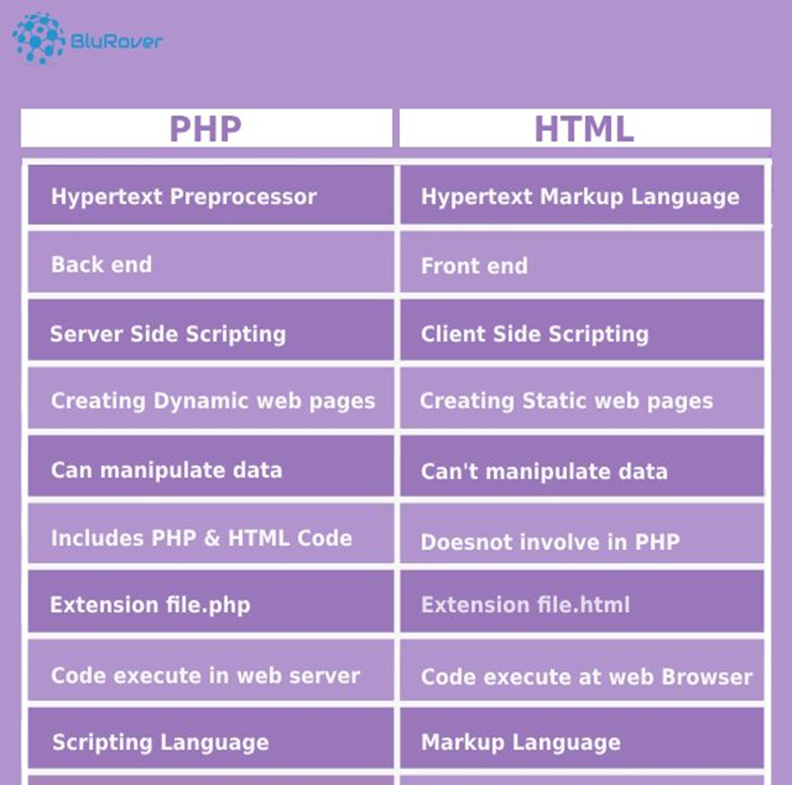
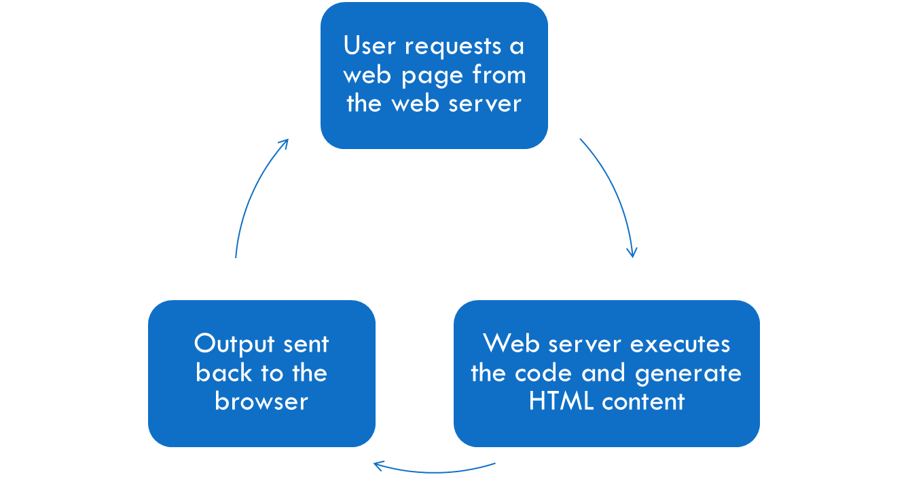

# Chapter 5 Server Side Scripting
## Index
* [Chapter 5 Server Side Scripting](#chapter-5-server-side-scripting)
  * [Index](#index)
  * [5.1 Server-Side Scripting Languages](#51-server-side-scripting-languages)
    * [Note](#note)
  * [5.2 Working Principle of Server-Side Scripting](#52-working-principle-of-server-side-scripting)
    * [HTTP methods](#http-methods)
    * [Differences of Scripting Languages](#differences-of-scripting-languages)
  * [5.3 PHP](#53-php)
    * [Basic Syntax](#basic-syntax)
      * [Example 1](#example-1)
      * [Example 2](#example-2)
    * [Comment](#comment)
    * [Variable](#variable)
    * [Operation and Expression](#operation-and-expression)
    * [Output](#output)
    * [Control Statement](#control-statement)
      * [Conditional Statements](#conditional-statements)
      * [Loops Statements](#loops-statements)
    * [Function](#function)
      * [Creating a Function](#creating-a-function)
      * [Adding Function Paramater](#adding-function-paramater)
      * [Function Return Values](#function-return-values)
      * [Create Data Model](#create-data-model)
    * [Session](#session)
    * [Security Control](#security-control)

## 5.1 Server-Side Scripting Languages
1. PHP is one of a server-side scripting language.
2. PHP can handle forms, save data to a file, return data to the user, gather data from files, etc.
3. **Example 1**: Let say a website that takes user to view the order status after logging in. By PHP coding, you would send a query to the database that would then output the specific user information based on what information is in the database.
4. The scripts can be written in any of a number of server-side scripting languages available (Example: PHP, JavaScript, C#, Python).
5. Server-side scripting differs from client-side scripting which are run client-side in the web browser.
6. Server-side code is used to retrieve and generate content for the dynamic pages (Example: to retrieve the content from database).
7. The User requests a web page from the web server.
8. THe web server executes the code (no PHP code ever reaches the user) in the web page and generates an HTML content for that page.
9. Information it outputs (the html content) is sent back to the browser so that it can be displayed to the user.

### Note
1. the code os called "server side code / script" because it is executed by the web server.
2. the page containing the code is called dynamic page.
3. By the time the data get's to the user's browser, there is no PHP code left, only the HTML code remains.
4. That's why if attempt to run your PHP documents on a computer with no web server will only display the code instead of its output.



[Back to Top](#chapter-6---graphic-usage)

## 5.2 Working Principle of Server-Side Scripting



### HTTP methods
| Method  | Description                                                                                    |
| ------- | ---------------------------------------------------------------------------------------------- |
| GET     | Retrieve data from the server.                                                                 |
| POST    | Submits data to be processed to a specified resource.                                          |
| PUT     | Updates or replaces the existing resource.                                                     |
| DELETE  | Deletes the specified resource.                                                                |
| HEAD    | Retrieves response headers identical to those of a GET request, but without the response body. |
| CONNECT | Establishes a tunnel to the server identified by the target resource.                          |
| OPTIONS | Describes the communication options for the target resource.                                   |
| TRACE   | Performs a message loop-back test along the path to the target resource.                       |
| PATCH   | Applies partial modifications to a resource.                                                   |

### Differences of Scripting Languages
|                 | Server-Side Scripting | Client-Side Scripting |
| --------------- | --------------------- | --------------------- |
| Platform        | Web Server            | Web Browser           |
| Execution       | Before page load      | After page load       |
| Source Code     | Unseen                | Visible               |
| Need For Server | Yes                   | No                    |

[Back to Top](#chapter-6---graphic-usage)

## 5.3 PHP
1. **PHP** stands for Hypertext Preprocessor and is a server-side scripting language.
2. The script is run on your web server, not on the user's browser.
3. PHP is one of the most popular scripting languages on the internet.
4. PHP scripts are always enclosed in between two **PHP tags**.
5. This tags tells the web server to parse the information between the tags as PHP.

### Basic Syntax
1. Follwing are different styles of PHP tags:
   * `<?php ... ?>`
   * `<? ... ?>`
2. The statement can also be phrased as simply `<?` if desired.
3. Anything outside of these PHP tags is read as HTML, hence the PHP code can easily switch between PHP and HTML as needed.
4. There are two ways to use HTML on PHP page.
   - **Method 1**: Using `echo` or `print` statement. This method include the HTML code in the PHP tags.
   - **Method 2**: Using `<?php` and `?>` are put in the middle HTML.
5. Each code line in PHP must end with a semicolon. The semicolon is a separator and is used to distinguish one set of instructions from another.
#### Example 1
```php
<html>
<body>
<?php
echo "Hello World!";
?>
<b>Here is some more HTML</b>
</body>
</html>
```
#### Example 2
```php
<?php
echo "<h1>Hello World!</h1>";
?>
```

### Comment
1. portion of a program that exists for the human reader and stripped out before displaying the programs result.
2. All text that appears between the start of the comment and the end will be ignored,
3. There are two commenting formats in PHP:
    - **Single Line Comment**: `//`
    - **Multi Line Comment**: `/* ... */`

### Variable
1. Variables **can**, but do **not need**, to be declared before assignment.
2. Variables in PHP do not have **intrinsic types** - a variable does not know in advance whether it will be used to store a number or a string of characters.
3. All variables in PHP start with a `$` sign.
4. Several Variable types but the most common is the string.
5. Variables can hold `text` and `numbers`.
6. Variable name must begin with a **letter** or the **underscore** character.
7. Variable name **should not contain spaces**.
8. Variable names are **case sensitive** ($y and $Y are two different variables).
9. Constants hold fixed values that cannot be changed once defined.
10. Declaration Methods:
    - Using `define()`
      - `define("SITE_NAME", "MyWebsite");`
    - Using `const`:
      - `const VERSION = 1.0;`
11. Naming: Typically uppercase, with underscores for readability. (e.g., MAX_USERS).
12. Constants are automatically global and accessible across the script.
13. Can store scalar types like strings, integers, and floats.
14. Usage (as ENUM in other languages but now version PHP 8.1 has ENUM):
  - ```php
      class Day {
        const SUNDAY = 0;
        const MONDAY = 1;
        const TUESDAY = 2;
        const WEDNESDAY = 3;
        const THURSDAY = 4;
        const FRIDAY = 5;
        const SATURDAY = 6;
      }
    ```
  - ```php
      $today = Day::MONDAY;
      echo $today;
    ```

### Operation and Expression
1. Expressions are used to perform operations and give an answer to a single value.
2. Expressions consist of two parts: **operators** and **operands**.
3. Operands canbe:
  1. Variables
  2. Numbers
  3. Strings
  4. Boolean values
  5. other expressions
4. Operators are used to perform operations on operands. (variables and values).
5. Following are major categories of operator supported by PHP.
  1. Arithmetic Operators
    - `+` Addition
    - `-` Subtraction
    - `*` Multiplication
    - `/` Division
    - `%` Modulus
  2. Comparison Operators
    - `==` Equal
    - `!=` Not Equal
    - `>` Greater Than
    - `<` Less Than
    - `>=` Greater Than or Equal To
    - `<=` Less Than or Equal To
  3. Logical Operators
    - `&&` Logical AND
    - `||` Logical OR
    - `!` Logical NOT
    - `XOR` Logical XOR
  4. Assignment Operators
    - `=` Assign
    - `++` Increment
    - `--` Decrement
### Output
1. `echo` and `print` are more or less the same.
2. However, `echo` statement will run slightly faster than `print`.
3. Echo and print uses quotes to define the beginning and end of the string.
4. Hence, to use a quotation mark inside the echo or print, the escape character `\` must be used.
5. The blackslash `\` will tell PHP that the quotations are to be used within the string and NOT to be used to end echo's string.

### Control Statement
1. Control statement consist of a set of commands that executes if a specified condition is TRUE.
2. Control statements are used to decide which lines of code are evaluated, or how many times to evaluate them.
3. There are TWO different types of control statements:
  1. **conditional** statements
  2. **loop** statements

#### Conditional Statements
1. Conditional statements are used to make decisions about which sections of code to evaluate.
2. Conditional statements perform different actions (decision) based on different conditions.
3. PHP supports the following conditional statements:
  1. `if` statement
  2. `if...else` statement
  3. `if...elseif...else` statement
  4. `switch` statement
4. `if` statement is used to execute some code **ONLY IF** a specified condition is **TRUE**.
5. There are **TWO** major parts to an if statement:
  1. Condition: an expression that will evaluate to be either TRUE or FALSE.
  2. Statement: the action (code) to be executed if the condition is TRUE.
6. If the condition is **TRUE**, given **Statement 1** are **executed**.
7. If expression is **FALSE** then **NO statement**/**Next Statement** would be executed.
8. The `switch` statement is used to perform **DIFFERENT ACTIONS** base on **DIFFERENT CONDITIONS**.
9. The `switch` statement used **TO AVOID** long blocks of `if...else if...else` code.
  - ```php
      switch (n) {
        case label1:
          code to be executed if n=label1;
          break;
        case label2:
          code to be executed if n=label2;
          break;
        case label3:
          code to be executed if n=label3;
          break;
        default:
          code to be executed if n is different from all labels;
      }
    ```
#### Loops Statements
1. Each case is checked against the condition **until a match is found**.
2. The `break` statements indicate end of that case.
3. If **nothing matches**, a default condition will be used. 
4. Loops in PHP are used to execute the same block of code a specified number of times or while a specified condition is true.
5. Conditional statements perform different actions (decision) based on different conditions.
6. PHP supports the following loop statements:
  1. `for` loop
    - ```php
        for (init; test; increment) { code to be executed; } 
      ```
  2. `while` loop
    - ```php 
        while (condition) { code to be executed; }
      ```
  3. `foreach` loop
    - ```php
        foreach ($array as $value) {
          code to be executed;
        }
      ```

### Function
1. To keep the script from being executed when the page loads, code can be placed into a function.
2. A function is a piece of code which takes one more input in the form of parameter and does some processing and returns a value.
3. This allows to only write the code once and save a lot of time and space.
4. PHP offers several functions for different purpose.

#### Creating a Function
1. A function will **ONLY** be executed by a **CALL** to the function.
2. A function can be called from anywhere within a page.
3. A function's name should start with keyword `function` and all the PHP code should be enclosed in curly braces `{}`.

#### Adding Function Paramater
1. To add more functionality to a function, parameters are used.
2. A parameter is just like a variable.
3. Parameters are specified after the function name, **INSIDE** the parentheses.

#### Function Return Values
1. To let a function return a value, the `return` statement are used.
2. Example:
3. ```php
    function add($x, $y) {
      $total = $x + $y;
      return $total;
    }
   ```

#### Passing Arguments by Reference
1. Possible to pass arguments to functions by **reference**. This means that a reference to the variable is manipulated by the function rather than a copy of the variable's value.
2. Any changes made to an argument in these cases will change the value of the original variable.
3. Passing argument by reference are done by adding on ampersand `&` to the variable name in either the function call OR the function definition.

### Array
1. special variable which can holds more than one value at a time, each stored in its own numbered `space` in the array.
2. In PHP, the `array()` function is used to create an array.
3. There are `THREE` types if array:
  1. **Indexed Array**: Arrays with a numeric index.
  2. **Associative Array**: Arrays with named keys.
  3. **Multidimensional Array**: Arrays containing one or more arrays.

#### Indexed Array
1. TWO ways to create an indexed array:
  1. Using `array()` function.
      - ```php
          $cars = array("Volvo", "BMW", "Toyota");
        ```
  2. Using `[]` brackets.
      - ```php
          $cars[] = "Volvo";  // $cars[0] = "Volvo";
          $cars[] = "BMW";    // $cars[1] = "BMW";
          $cars[] = "Toyota"; // $cars[2] = "Toyota";
        ```

#### Associative Array
1. The associative array indexes the contained elements by strings.
2. The array are **created** using the `=` and the `>`, like: `key => value`.
3. There are TWO ways to create associative arrays: 
   1. The index can be assigned automatically (index always starts at 0):
   2. Example: 
      ```php
         $age = array("Peter"=>"35", "Ben"=>"37", "Joe"=>"43");
       ```
   3. Or the index can be assigned individually:
   4. Example:
      ```php
         $cars[keyName1] = value1;
         $cars[keyName2] = value2;
         $cars[keyName3] = value3;
       ```

#### Multidimensional Array
1. In a multi-dimensional array, each element in the main array can also be an array.
2. And, each element in the sub-array can be an array, and so on.
3. Values in the multi-dimensional array are accessed using multiple index.

### Class
1. A class is a blueprint for creating objects.
2. Defines a set of properties and methods that the created objects will have.
3. A class is a template for objects, and an object is an instance of a class.
4. Exmaple:
    - ```php
        class Fruit {
          // Properties
          public $name;
          public $color;

          // Methods
          function set_name($name) {
            $this->name = $name;
          }
          function get_name() {
            return $this->name;
          }
        }
      ```
    - Creating Apple and Banana objects:
    - ```php
        $apple = new Fruit();
        $banana = new Fruit();
        $apple->set_name('Apple');
        $banana->set_name('Banana');

        echo $apple->get_name();
        echo "<br>";
        echo $banana->get_name();

      ```

### Form Handling
1. Setting up a form for use with PHP script is exactly the same as normal in HTML.
2. All the elements for your form must be enclosed in the `<form>` tags. They are used as follows:
    - ```php
        <form action="process.php" method="post">
          Name: <input type="text" name="name"><br>
          E-mail: <input type="text" name="email"><br>
          <input type="submit">
        </form>
      ```
3. The form's action tells which php page to send its data for processing.
4. This can also be a full URLL (Ex: `http://www.example.com/process.php`).
5. Method attribute tells the form how to send the data.
   1. `POST` will send the data in a data stream to php page when it is requested.
   2. `GET` will send the form data in the form of the **url** so it would appear after a question mark `?`.
      1. Example: `http://www.mysite.com/process.php?name=david`
   3. The predefined `$_POST` variable is used to collect values from a form sent with `method="post"`.
   4. Example:
      - ```php
          <form method="post" action="welcome.php">
            Name: <input type="text" name="name">
            Age: <input type="text" name="age">
            <input type="submit">
          </form>
        ```
   5. When the user clicks the "Submit" button, the URL will look like this:
      - `http://www.example.com/welcome.php`
   6. The `welcome.php` file can now use the `$_POST` variable to collect form data (the form data is sent with the `POST` method).
   7. Example:
      - ```php
          $name = $_POST['name'];
          $age = $_POST['age'];
          echo "Welcome $name! You are $age years old.";
        ```
   8. The predefined `$_GET` variable is used to collect values from a form with `method="get"`.
   9. Example:
      - ```php
          <form method="get" action="welcome.php">
            Name: <input type="text" name="name">
            Age: <input type="text" name="age">
            <input type="submit">
          </form>
        ``` 
   10. When the user clicks the "Submit" button, the URL will look like this:
      - `http://www.example.com/welcome.php?name=David&age=28`
   11. The `welcome.php` file can now use the `$_GET` variable to collect form data (the form data is sent with the `GET` method).
   12. Example:
      - ```php
          $name = $_GET['name'];
          $age = $_GET['age'];
          echo "Welcome $name! You are $age years old.";
        ```
   13. The `GET` method is restricted to send up to **1024 characters only**.
   14. **Never** use `GET` method if **password or other sensitive information** are to be sent to the server.
   15. GET `CAN'T` be used to send binary data, like images or word documents, to the server.
6.  Comparison of `GET` and `POST` methods:
    | Feature                   | GET Method                                                | POST Method                                              |
    | ------------------------- | --------------------------------------------------------- | -------------------------------------------------------- |
    | Data Visibility           | Data is visible to everyone in the URL                    | Data is not displayed in the URL                         |
    | Data Length Limitation    | Limited data length (browser/server dependent)            | No specific limitation (much larger data capacity)       |
    | Data Type                 | Only ASCII characters                                     | No restrictions (binary data is also allowed)            |
    | Bookmarking               | Can be bookmarked                                         | Cannot be bookmarked                                     |
    | Caching                   | Can be cached                                             | Generally not cached                                     |
    | Idempotence               | Idempotent (repeating request doesn't change the outcome) | Non-idempotent (repeating can cause different outcomes)  |
    | Use Cases                 | Retrieving data (like search results)                     | Submitting data to the server (like forms)               |
    | Security                  | Less secure (data in URL could be logged)                 | More Secure (data is not displayed in the URL)           |
    | History                   | Parameters remain in browser history                      | Parameters not saved in browser history                  |
    | Restrictions on Data Type | Suitable for simple text query strings                    | Suitable for complex data including file uploads         |
    | Server Processing         | Limited processing (mainly for data retrieval)            | More complex processing (like database write operations) |
### Introduction to CRUD
1. **CRUD** stands for **Create**, **Read**, **Update**, and **Delete**.
2. Set of operations used to manage data in web applications.
3. CRUD is essential for the functioning of any database-driven web application.

#### CREATE
1. CREATE in CRUD
   1. The Create operation allows users to add new data to a database.
   2. Typically executed via forms on web interfaces.
   3. Example: A user registering a new account on a website.
   4. ```sql
        INSERT INTO users (first_name, last_name, email, role) VALUES ('John', 'Doe', 'john.doe@example.com', 'student');
      ```
2. READ in CRUD
   1. The Read operation is used to retrieve data from a database.
   2. It can be as simple as viewing a blog post or listing all users.
   3. Common methods include SELECT statements in SQL.
   4. Example:
   5. ```sql
        SELECT first_name, last_name, email FROM users WHERE role = 'student';
      ```
3. UPDATE in CRUD
   1. Update is used to modify existing data in the database.
   2. This could involve changing user details, like email or password.
   3. Often done through web forms, similar to Create, but modifies existing records.
   4. Example:
   5. ```sql
        UPDATE users SET email = 'john.newemail@example.com' WHERE first_name = 'John' AND last_name = 'Doe';
4. DELETE in CRUD
   1. Delete operation removes data from the database.
   2. Critical for data management and maintaining data relevance.
   3. Example: A user deleting their account or a post.
   4. ```sql
        DELETE FROM users WHERE first_name = 'John' AND last_name = 'Doe';
      ```
#### Create Database Connection
1. **Database connection** - to establish a connection between the database server `Database.php`
2. ```php
    <?php
      private $host = "localhost";
      private $db_name = "your_db_name";
      private $username = "root";
      private $password = "";
      public $conn;

      public function getConnection(){
        $this->conn = new mysqli($this->host, $this->username, $this->password, $this->db_name);

        // Check connection
        if ($this->conn->connect_error) {
          die("Connection failed: " . $this->conn->connect_error);
        }
        
        return $this->conn;
      }
    ?>
   ```
3. `Database` Class:
   1. Purpose: Establishes a connection to the MySQL database.
   2. `getConnection()`: Connects to the database using `MySQLi`.

#### Create Data Model 
1. `User.php`
2. ```php
    <?php
      class User {
        private $conn;

        public function __construct($db){
          $this->conn = $db;
        }

        public function createUser($matric, $name, $password, $role){
          $password = password_hash($password, PASSWORD_DEFAULT);

          $sql = "INSERT INTO users (matric, name, password, role) VALUES (?, ?, ?, ?)";
          $stmt = $this->conn->prepare($sql);
          
          if ($stmt) {
            $stmt->bind_param("ssss", $matric, $name, $password, $role);
            $result = $stmt->execute();
            $stmt->close(); // Close the statement after execution to free up resources.
            if ($result) {
              return true;
            } else {
              return "Error: " . $stmt->error;
            }
          } else {
            return "Error: " . $this->conn->error;
          }
        }

        public function getUsers()
        {
          $sql = "SELECT matric, name, role FROM users";
          $result = $this->conn->query($sql);
          return $result;
        }

        public function getUser($matric)
        {
          $sql = "SELECT matric, name, role FROM users WHERE matric = ?";
          if($stmt) {
            $stmt->bind_param("s", $matric);
            $stmt->execute();
            $result = $stmt->get_result();
            $user = $result->fetch_assoc();

            $stmt->close(); // Close the statement after execution to free up resources.
            return $user;
          } else {
            return "Error: " . $this->conn->error;
          }
        }

        public function updateUser($matric, $name, $role)
        {
          $sql = "UPDATE users SET name = ?, role = ? WHERE matric = ?";
          $stmt = $this->conn->prepare($sql);
          if ($stmt) {
            $stmt->bind_param("sss", $name, $role, $matric);
            $result = $stmt->execute();
            $stmt->close(); // Close the statement after execution to free up resources.
            if ($result) {
              return true;
            } else {
              return "Error: " . $stmt->error;
            }
          } else {
            return "Error: " . $this->conn->error;
          }
        }

        public function deleteUser($matric)
        {
          $sql = "DELETE FROM users WHERE matric = ?";
          $stmt = $this->conn->prepare($sql);
          if ($stmt) {
            $stmt->bind_param("s", $matric);
            $result = $stmt->execute();
            $stmt->close(); // Close the statement after execution to free up resources.
            if ($result) {
              return true;
            } else {
              return "Error: " . $stmt->error;
            }
          } else {
            return "Error: " . $this->conn->error;
          }
        }
      }
    ?>
   ```
3. `User` Class:
   1. Purpose: Contains methods to interact with the `users` table in the database.
   2. Constructor: (__construct): Initializes the database connection.
4. Create:
   1. `creatUser($matric, $name, $password, $role)`
   2. Hashes the password for security.
   3. Prepares an `INSERT` statement
   4. Binds the parameters and executes the statement.
   5. Returns `true` if successful, otherwise returns an error message.
5. Read:
   1. `getUsers()`
      1. Executes a `SELECT` statement to fetch all users.
      2. Returns the result set.
   2. `getUser($matric)`
      1. Prepares a `SELECT` statement to fetch a specific user.
      2. Binds the matric parameter and executes the statement.
      3. Returns the user details.
6. Update:
   1. `updateUser($matric, $name, $role)`
      1. Prepares an `UPDATE` statement.
      2. Binds the parameters and executes the statement.
      3. Returns `true` if successful, otherwise returns an error message.
7. Delete:
   1. `deleteUser($matric)`
      1. Prepares a `DELETE` statement.
      2. Binds the matric parameter and executes the statement.
      3. Returns `true` if successful, otherwise returns an error message.
8. Addtional Notes:
   1. Prepared statements are used to prevent SQL injection.
   2. `bind_param` binds the parameters to the statement.
   3. `execute` runs the statement.
   4. `get_result` fetches the result set.
   5. `fetch_assoc` fetches a row from the result set as an associative array.
   6. `close` closes the statement to free up resources.
   7. `password_hash` hashes the password for security.

#### CRUD Record
1. `register_form.php` - Page Form to register a new user.
2. ```php
    <form action="insert.php" method="post">
        <label for="matric">Matric:</label>
        <input type="text" name="matric" id="matric" required><br>
        <label for="name">Name:</label>
        <input type="text" name="name" id="name" required><br>
        <label for="password">Password:</label>
        <input type="password" name="password" id="password" required><br>
        <label for="accessLevel">Role:</label>
        <select name="role" id="accessLevel" required>
            <option value="">Please select</option>
            <option value="lecturer">Lecturer</option>
            <option value="student">Student</option>
        </select><br>
        <input type="submit" name="submit" value=”Register">
    </form>
   ```
3. `insert.php` - Handling form submission and inserting a new user.
4. ```php
    <?php
      include_once 'Database.php';
      include_once 'User.php';

      $database = new Database();
      $db = $database->getConnection();

      $user = new User($db);
      $user->createUser($_POST['matric'], $_POST['name'], $_POST['password'], $_POST['role'])

      $db->close();
    ?>
   ```
5. For others CRUD operations, can refer to:
   1. [update_form.php](https://github.com/ariffinmzin/webdev_week_10_2_20232024/blob/main/update_form.php)
   2. [update.php](https://github.com/ariffinmzin/webdev_week_10_2_20232024/blob/main/update.php)
   3. [delete.php](https://github.com/ariffinmzin/webdev_week_10_2_20232024/blob/main/delete.php)
6. Building Login Page
   1. A login page require:
      1. **Login form** - take username and password as input.
      2. **Table** - to check registered username and password.
      3. **Action page** - to verify username and password.
   2. `login_form.php` - Page Form to login.
   3. ```php
        <form action="login.php" method="post">
            <label for="matric">Matric:</label>
            <input type="text" name="matric" id="matric" required><br>
            <label for="password">Password:</label>
            <input type="password" name="password" id="password" required><br>
            <input type="submit" name="submit" value="Submit">
        </form>
      ```
   4. **Action page** - to verify username and password.
   5. Action page requires:
      1. **Database connection** - to execute query.
      2. **Query** - to pull out records from database.
      3. **Control statement** - compare input data and query result - execute code based on given conditions.
   6. `authnticate.php` - Handling form submission and authenticating user.
   7. ```php
        <?php
          include_once 'Database.php';
          include_once 'User.php';

          if (isset($_POST['submit']) && ($_SERVER['REQUEST_METHOD'] == 'POST')) {
            // Create database connection
            $database = new Database();
            $db = $database->getConnection();

            // Sanitize inputs using mysqli_real_escape_string
            $matric = $db->real_escape_string($_POST['matric']);
            $password = $db->real_escape_string($_POST['password']);

            // Validate inputs
            if (!empty($matric) && !empty($password)) {
              $user = new User($db);
              $userDetails = $user->getUser($matric);

              // Check if user exists and verify password
              if ($userDetails && password_verify($password, $userDetails['password'])) {
                  echo 'Login Successful';
              } else {
                  echo 'Login Failed';
              }
            } else {
              echo 'Please fill in all required fields.';
            }
          }
          $db->close();
        ?>
      ```
#### Search Page
1. ```php
    <form action="<? $_SERVER['PHP_SELF'] ?>?view=yes" method="post">
      <select name="year">
        <option value="2013">2013</option>
        <option value="2012">2012</option>
      </select>
      <select name="grade">
        <option value="A">A</option>
        <option value="B">B</option>
      </select>
      <input type="submit" name="submit" value="Search">
    </form>
   ```

### Session
1. A PHP session allows storing user information on the **web server** for later use (i.e. username, shopping items, etc).
2. However, session information is **temporary** and will be **deleted** after the user has left the website or being idle for a period set by the administor.
3. Session variables are available **across multiple pages** in one application.
4. Before you can store user information in your PHP session, you must first start up the session using the `session_start()` function.
5. **Note**: The `session_start()` function must appear BEFORE the `<html>` tag.
6. Session are stored and can be retrieved using the `$_SESSION`.
7. **Example**:
8. ```php
    <?php
      session_start();
      $_SESSION['uid'] = uniqid();
    ?>
    <html>
    <body>
    </body>
    </html>
   ```
9. The code above will register the user's session with the server, allow you to start saving user information, and assign a UID for that user's session.
10. A PHP session can be destroyed by calling the `session_destroy()` function.
11. This function does not need any arguments and a single call will destroy all the session variables.

### Cookies
1. A cookie is often used to identify a user.
2. A cookie is a small file that the server embeds on the **user's computer**.
3. Each time the same computer requests a page with a browser, it will send the cookie too.
4. With PHP, you can both create and retrieve cookie values.
5. The `setcookie()` function is used to set a cookie.
6. **Note**: The `setcookie()` function must appear BEFORE the `<html>` tag.
7. **Syntax**:
8. ```php
    setcookie(name, value, expire, path, domain, secure, httponly);
   ```
9. **Name** - This sets the name of the cookie.
10. **Value** - This sets the value of the cookie.
11. **Expiry** - The time in seconds when the cookie will expire and be deleted.
12. The PHP `$_COOKIE` variable is used to retrieve a cookie value.
13. In the example below, we retrieve the value of the cookie named "user" and display it on a page:
14. ```php
    <?php
      echo $_COOKIE['user'];
    ?>
   ```
15. To delete a cookie, set the cookie with a date that has already expired.
16. **Example**:
17. ```php
    setcookie("user", "", time() - 3600);
   ```

### Security Control
1. **Clean up all user input**
   1. One of the most common exploits are the result of unintended user input.
   2. **User input by URL, forms and cookies has to get cleaned up** from any exploitable input before doing anything with it.
   3. Check each value to make sure it is something expected and assign it to a local variable for use.
   4. **Ex**: use of PHP functions such as `mysqli_real_escape_string()`, `intval()`, `eregi_replace()` etc.
   5. `Hide your errors`
      1. not a good idea to show the world your errors. Not only does it make you look bad, it also might give **malicious users** another **clue to help them break your site**.
      2. should always have `display_errors` disabled in a production environment, but continue logging errors with **log_errors** for your own information.
   6. **PHP: Header Injection**
      1. A header forward, without a `exit()` or `die()` could continue to load the page if the browser (or an exploiter) continues to load the page.
      2. In PHP, the `header()` function is send a raw HTTP header to the client. If you use `header()` to redirect the user to a different page (e.g. `header("Location: http://www.example.com/");`), the PHP interpreter will continue to execute the script after the `header()` function call unless you explicitly stop it with `exit()` or `die()`.
      3. means that even though the user's browser may start loading the new page, any PHP code that comes after the `header()` function will still be executed. Lead to Unexpected behavior, especially if you have database operations or other side effects after the `header()` call.

[Back to Top](#chapter-5-server-side-scripting)

[Next Chapter](C6.md)
[Back to README](README.md)

