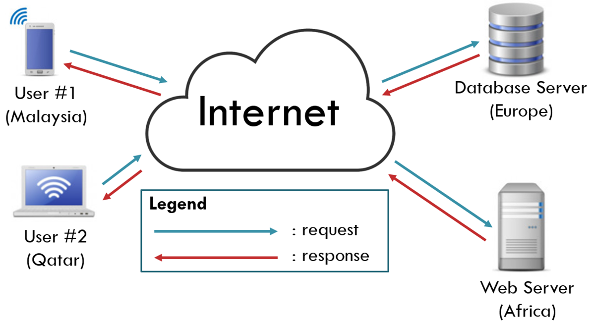
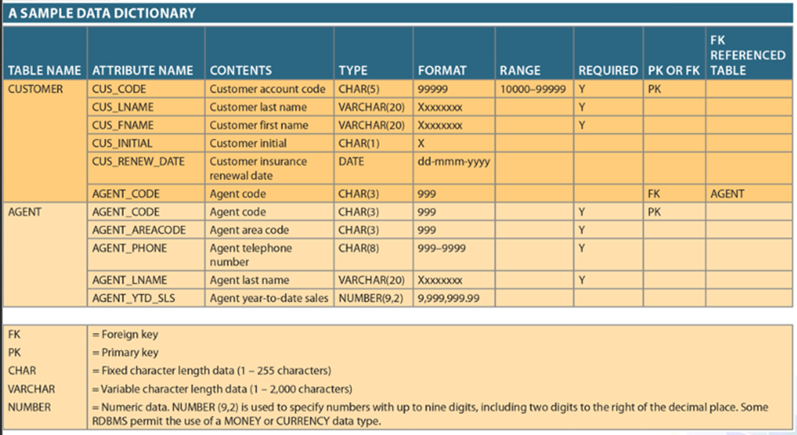

# Chapter 7 - Web & Database
## Index
* [Chapter 7 - Web \& Database](#chapter-7---web--database)
  * [Index](#index)
  * [7.1 Introduction to SQL and DBMS.](#71-introduction-to-sql-and-dbms)
    * [DBMS](#dbms)
      * [MySQL](#mysql)
      * [Pseudo Code](#pseudo-code)
    * [System Architecture](#system-architecture)
    * [Database Connection](#database-connection)
      * [MySQLi](#mysqli)
      * [PDO](#pdo)
    * [SQL (Structured Query Language)](#sql-structured-query-language)
      * [DML \&\& DDL](#dml--ddl)
      * [`SELECT` Statement](#select-statement)
      * [`WHERE` Clause](#where-clause)
      * [DISTINCT](#distinct)
      * [JOIN](#join)
      * [ORDER BY](#order-by)
      * [INSERT](#insert)
      * [UPDATE](#update)
      * [DELETE](#delete)
  * [7.2 Design and model database](#72-design-and-model-database)
    * [Database Model](#database-model)
    * [Data Dictionary](#data-dictionary)
      * [Table](#table)
      * [Column](#column)
      * [Row](#row)
      * [Primary Key](#primary-key)
        * [Example](#example)
      * [Foreign Key](#foreign-key)
        * [Example:](#example-1)
      * [Relationship](#relationship)
        * [One-to-Many (1:1)](#one-to-many-11)
        * [One-to-Many (1:M)](#one-to-many-1m)
        * [Many-to-Many (M:N)](#many-to-many-mn)
      * [Normalization](#normalization)

## 7.1 Introduction to SQL and DBMS.

### DBMS
1. collection of programs that manages the database structure and controls access to the data stored in the database.
2. MySQL
3. Microsoft SQL Server
4. Oracle 
5. PostgreSQL
6. SQLite
7. Microsoft Access

#### MySQL
1. Free, open-source relational DBMS
2. A component of LAMP (Linux, Apache, MySQL, PHP) stack.
3. Runs on Linux/Unix, Windows, and Mac OS.
4. Access to data based on SQL (Structured Query Language).
5. Can be used in many different programming languages.

#### Pseudo Code
1. Connect to host server.
2. Select database.
3. Write SQL statement
4. Execute SQL statement
5. Close connection

### System Architecture


### Database Connection
1. Required Information:
   1. Hostname
   2. Username
   3. Password
   4. Database Name
2. PHP can work with a MySQL database using the following methods:
   1. MySQL extension: deprecated in 2012.
   2. MySQLi extension: improved version of MySQL.
   3. PDO (PHP Data Objects): a data-access abstraction layer.
3. PDO works on various DBMS, whereas MySQLi works only with MySQL.

#### MySQLi
1. The mysqli extension supports the following approaches:
   1. Procedural approach
   2. Object-oriented approach
2. Reference to a complete list of the properties and methods of the mysql:
3. [MySQLi Reference](https://www.php.net/manual/en/book.mysqli.php)
4. Procedural Example:
```php
<?php
$servername = "localhost";
$username = "username";
$password = "password";
$dbname = "myDB";

$conn = mysqli_connect($servername, $username, $password, $dbname);

if (!$conn) {
    die("Connection failed: " . mysqli_connect_error());
}
echo "Connected successfully";

$query = "SELECT * FROM table";
$result = mysqli_query($conn, $query);

while ($row = mysqli_fetch_array($result)) 
{
    // use row to fetch the elements of each column
}

mysqli_close($conn);
?>
```
5. Object-oriented Example:
```php
<?php
$servername = "localhost";
$username = "username";
$password = "password";
$dbname = "myDB";

$conn = new mysqli($servername, $username, $password, $dbname);

if ($conn->connect_error) {
    die("Connection failed: " . $conn->connect_error);
}

echo "Connected successfully";

$query = "SELECT * FROM table";
$result = $conn->query($query);

$row = $result->fetch_assoc();

echo $row["column_name"];

$conn->close();
?>
```

#### PDO
1. PDO Example:
```php
<?php
$servername = "localhost";
$username = "username";
$password = "password";

try {
    $conn = new PDO("mysql:host=$servername;dbname=myDB", $username, $password);
    $conn->setAttribute(PDO::ATTR_ERRMODE, PDO::ERRMODE_EXCEPTION);
    echo "Connected successfully";
}
catch(PDOException $e) {
    echo "Connection failed: " . $e->getMessage();
}

$conn = null;
?>
```

### SQL (Structured Query Language)
1. A standard language for specifying accesses and modifications to relational databases.
2. Supported by DBMS of major vendors.
3. Reserved words are not case-sensitive, but table names and table columns may/may not be case-sensitive depending on vendor.

#### DML && DDL
1. SQL can be divided into **TWO** parts:
2. DML (Data Manipulation Language):
   1. SELECT: extracts data from a database.
   2. INSERT: inserts new data into a database.
   3. UPDATE: updates existing data within a database.
   4. DELETE: deletes all records from a table.
3. DDL (Data Definition Language):
   1. CREATE DATABASE: creates a new database.
   2. ALTER DATABASE: modifies a database.
   3. CREATE TABLE: creates a new table.
   4. ALTER TABLE: modifies a table.
   5. DROP TABLE: deletes a table.
   6. CREATE INDEX: creates an index (search key).
   7. DROP INDEX: deletes an index.

#### `SELECT` Statement
1.  The `SELECT` statement is used to select data from a database.
2.  The `SELECT` statement returned **ALL** the results from the queried database table.
3.  A simple `SQL SELECT` statement, requires:
    1.  Column(s) Name
    2.  Table Name
4.  Syntax:
    ```sql
    SELECT column1, column2, ...
    FROM table_name;
    ```
#### `WHERE` Clause
1. The `WHERE` clause not only used in `SELECT` statement, but it `UPDATE`, `DELETE` statement etc.
2. The `WHERE` clause is used to `FILTER` records that satisft a given condition.
3. The `WHERE` clause returned `MATCHING` results from the queried database table restricted to a specific condition.
4. **"condition"** is the filter to be applied on the results. The filter could be a range, single value or sub query.
5. With the WHERE clause, the following operators can be used:
   1. | Operator | Description |
      |----------|-------------|
      | = | Equal |
      | <> | Not equal |
      | > | Greater than |
      | < | Less than |
      | >= | Greater than or equal |
      | <= | Less than or equal |
      | BETWEEN | Between an inclusive range |
      | LIKE | Search for a pattern |
      | IN | To specify multiple possible values for a column |

####　AND, OR, NOT
1. The `AND`, `OR`, `NOT` operators are used to filter records based on more than one condition.
2. Exmaple:
   ```sql
   SELECT * FROM table_name WHERE column1 = value1 AND column2 = value2;
   ```

#### DISTINCT
1. some of the columns may contain **duplicate** values. This is not a problem, however, sometimes there is a need to list **only the different** (distinct) values in a table.
2. The `DISTINCT` keyword can be used to return only distinct (different) values.
3. The SQL `DISTINCT` keyword is used in conjunction with `SELECT` statement to **eliminate** all the duplicate records and fetching only unique records.
4. Example:
   ```sql
   SELECT DISTINCT column1, column2, ...
   FROM table_name;
   ```

#### JOIN
1. The `JOIN` keyword is used in an SQL statement to query data from **TWO** or more tables, based on a relationship between certain columns in these tables.
2. The `INNER JOIN` keyword return rows when is at least **ONE** match in **BOTH** tables.
3. IF there are rows in table1 do not have matches in table2, these rows will **NOT** be listed.
4. Example:
    ```sql  
    SELECT column_name(s)
    FROM table1
    INNER JOIN table2
    ON table1.PK = table2.FK;
    ```

#### ORDER BY
1. The `ORDER BY` keyword is used to sort the query result by a specified column.
2. Example:
   ```sql
   SELECT column1, column2, ...
   FROM table_name
   ORDER BY column1, column2, ... ASC|DESC;
   ```

#### INSERT
1. The `INSERT INTO` statement is used to insert new records in a table.
2. Example:
   ```sql
   INSERT INTO table_name (column1, column2, column3, ...)
   VALUES (value1, value2, value3, ...);
   ```

#### UPDATE
1. The `UPDATE` statement is used to modify the existing records in a table.
2. Example:
   ```sql
   UPDATE table_name
   SET column1 = value1, column2 = value2, ...
   WHERE condition;
   ```

#### DELETE
1. The `DELETE` statement is used to delete existing records in a table.
2. Example:
   ```sql
   DELETE FROM table_name
   WHERE column1 = value1;
   ```

[Back to Top](#chapter-7---web--database)

## 7.2 Design and model database
### Database Model
1. An entity represents a particular type of object in the real-world.
2. An attribute is a characteristic of an entity.
3. A relationship is an association among entities.
   1. One-to-many (1:M)
   2. Many-to-many (M:N)
   3. One-to-one (1:1)
4. A constraint is a restriction placed on the data.

### Data Dictionary
 

#### Table
1. Databases are usually organized into one or more tables.
2. A table is a collection of related records regarding an entity.
3. A table stores data in a series of columns and rows.

#### Column
1. Columns are the **attributes** or **quanlities** of the entity described by the table.
2. Example:
   1. Entity: Student
   2. Attribute (column): student_id
3. Each column contains a different type of attribute.
4. known as **fields**.
5. A field is an area (within a record) reserved for a specific piece of data.
6. **Example**:
7. Fields are defined by **field name**, **data type**, and **field size**.
8. **Field name**
   1. Each column needs a **heading** to identify the data it contains.
   2. These headings are called field names.
   3. Field names are used to ensure that the data for each record is entered in the same sequence.
9. **Data type**
   1.  Data type ensures that all the data in a column is entered using the **same format**.
   2.  Example:
       1.  Character: text including such things as telephone numbers, zip codes.
       2.  Numeric: numbers.
       3.  Date: dates.
       4.  Logical: true/false or yes/no.
10. **Field Size**
    1.  Field size are the amount of space reserved for storing data

#### Row
1. Rows are knows as **records**.
2. A record is the **collection of values** for all the fields pertaining to one entity.
3. Every record in a table has exactly the **same structure**, but **different data**.
4. Each row corresponds to a single record.
5. Rows hold the actual data, with one (or zero) items for each column of the table.
6. Each row is identified by the values appearing in a particular column which has been identified as a unique INDEX.

#### Primary Key
1. Primary key is a special column or combination of columns that uniquely identifies each record (row) in a table.
2. The value that primary key hold must be unique for each record (row), and must not contain any nulls (non-values).
3. If it's possible that **TWO** or more records (past, present, or future) may **share the same value** for an attribute, it's a **poor choice** for a primary key.

##### Example
| Name | Department | Position |
|------|------------|----------|
| John | Customer management | Clerk |
| Paul | Customer management | Manager |
| Bill | Human Resource | Accountant |

1. No field is going to be guaranteed unique.
2. There are many people that share the smae name / department / position that may be added to the database in ther future.

**Solution:**
1. To avoid the uncertainty of using a data column as a primary key, many developers will create their own column which contains a **computer generated unique value**.
2. The Auto Increment Data type automatically increments the field each time a new record is created/
3. Hence, a better choice might be to use a unique employee ID nummber that you assign to each employee record when they're created.
4. Once you decide upon a primary key and set it up in the database, the database management will enforce the **uniqueness** (entity integrity - PK must be **unique** and **not be null**) of the primary key.
5. If a record to be inserted into a table has a primary key that duplicates an existing record, the insertion will fail.

#### Foreign Key
1. Foreign keys are columns in a table which provide a link to another table.
2. It is used to create relationships (correlate information) between tables.
3. Primary key uniquely defines a record, while a foreign key is used to **reference the same record** from another table.
4. When a table's primary key field is added to another table in order to relates the two tables, it is called a foreign key in the referenced table.
5. It is not necessarily that a primary key has any **corresponding value** in the referenced table.
6. Similarly, the value used in a Foreign Key column is **not necessarily unique** to the table it is in but must be unique to the table it is referring to (**Referencial Integrity**).

##### Example:
| cust_id (PK) | cust_name | cust_gender |
|--------------|-----------|-------------|
| 001 | John | Male |
| 002 | Paul | Male |
| 004 | Lilly | Female |

| order_id (PK) | item | cust_id (FK) |
|---------------|------|-------------|
| 001 | book | 001 |
| 002 | shirt | 002 |
| 003 | pen | 002 |

1. We don't need to store all the other customer information (name, gender, etc.) in the order table.
2. This is the elegance of the relational model.
3. Referential integrity is a database concept that **ensures that relationships between tables remain consistent**.
4. When one table has a foreign key to another table, the concept of referential integrity states that you may not add a record to the table that contains the foreign key unless there is a corresponding record in the linked table.
5. It also includes the techniques known as **cascade delete** and **cascade update**, which ensure that changes made to the linked table are reflected in the primary table.
6. Refertial integrity enforces the following three rules:
   1. The Order's FK attribtue must points to a valid record in the Customer table.
   2. If the primary key for a record in the Customer table changes, all corresponding records in the Order table must be modified using a **cascading update**.
   3. If a record in the Customer table is deleted, all corresponding records in the Order table must be deleted using a **cascading delete**.

#### Relationship
1. Relationships are they very core of relational databases.
2. The primary key, together with the closely related foreign key concept, are the main way in which relationships are defined.
3. Relationships allows description of the **connections between different database tables** in powerfull ways.
4. Once the relationships between your tables are described, that information can be used to perform powerful cross-table queries, known as joins.
5. In relational databases, a relationship exists between two tables when one of them has a foreign key that references the primary key of the other table.
6. There are three types of relationships:
   1. One-to-one (1:1)
   2. One-to-many (1:M)
   3. Many-to-many (M:N)
7. Each relationship are named according to the **number of tables rows** that may be involved in the relationship.

##### One-to-Many (1:1)
1. Occur when each entry in the first table has one, and only one, counterpart in the second table.
2. One-to-one relationships are rarely used because it's often more efficient to simply put all of the information in a single table.
3. It would be possible, although not really desirable, to store all the information in one table in this case.

##### One-to-Many (1:M)
1. This is the most common type of database relationship.
2. It occur when each record in the first table **corresponds to one or more records** in the second table but **each record in the second table corresponds to only one record in the first table**.
3. Example:
   1. Each student has only one teacher, but each teacher may have multiple students.

##### Many-to-Many (M:N)
1. This relationship occur when **each record in the first table corresponds to one or more records in the second table** and **each record in the second table corresponds to one or more records in the first table**.
2. Example:
   1. Each Teacher may instruct more than one course and each course may be taught by more than one teacher.
   2. an order can contain many products, and a product can be included in many orders.

#### Normalization
1. Process of evaluating and correcting table structures to minimize data redundancy and reduce the likelihood of data anomalies.

[Back to Top](#chapter-7---web--database)

[Next Page](C8.md)
[Back to README](README.md)